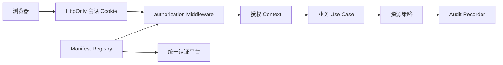

# 授权框架维护

## 目的与边界

本文档是本仓库授权框架维护的权威入口，描述如何维护认证后的 Application 授权、资源级访问决策、Manifest 注册与同步，以及管理端审计入口。业务模块的具体权限和资源策略仍由业务模块拥有；本文档不定义订单、目录等业务规则。

统一认证平台是用户、角色和 Application 权限的权威来源。本项目消费当前会话中的 Subject、Application Code 和权限集合，不在本地创建角色管理或权限分配页面。服务端始终是最终授权方，浏览器端的菜单和页面权限只用于导航与展示。

## 当前授权链路



认证模块负责建立和轮换会话；`authorization` 模块从会话恢复当前 Application 授权并执行权限中间件；业务 Use Case 继续执行租户、所有权、状态等资源范围规则。授权失败默认拒绝。

## 代码地图

| 能力 | 当前实现 |
|---|---|
| 授权上下文与中间件 | `api/internal/modules/authorization/` |
| 权限与 Manifest 注册 | `api/internal/modules/manifest/` |
| 资源定义与资源策略 | `api/internal/modules/authorization/application/resource.go`、各业务模块 `module.go` |
| 授权诊断接口 | `api/internal/modules/authorization/transport/http/resource_handler.go` |
| 审计记录与查询 | `api/internal/modules/audit/` |
| 业务模块注册边界 | `api/internal/application/registry.go` |
| 服务器组合根 | `api/cmd/server/main.go`、`api/cmd/server/business_runtime*.go` |
| 管理端权限与菜单 | `web/admin/src/app/AdminApp.jsx`、`web/admin/src/app/navigation.jsx` |
| 公共前台会话框架 | `web/src/framework/auth/` |
| API 合同 | `docs/contracts/openapi.yaml` |

## 稳定接口

### 服务端路由

- `GET /v1/authorization/me`：读取当前认证会话的 Application 授权上下文。
- `GET /v1/admin/resources`：列出业务模块注册的资源类型和动作，需要 `admin:access`。
- `POST /v1/admin/access-decisions/check`：解释当前管理员对资源动作的授权决策，需要 `admin:access`。
- `GET /v1/admin/audit-events`：查询关键审计事件，需要 `audit:read`。
- `GET /v1/internal/authorization-manifest`：读取本地 Manifest 状态，需要 `auth:manifest:read`。
- `POST /v1/internal/authorization-manifest/sync`：触发 Manifest 同步，需要 `auth:manifest:sync`。

以上路径、字段和错误码以 [`docs/contracts/openapi.yaml`](contracts/openapi.yaml) 为准；修改路由或响应前必须先更新合同并补充合同测试。

### 业务模块注册

后端业务模块实现 `api/internal/application.BusinessModule`，按模块顺序注册：

1. `RegisterPermissions`：注册权限码、风险等级和 API 绑定；
2. `RegisterResources`：注册资源类型、动作和可选资源策略；
3. `RegisterAuditEvents`：注册业务审计事件类型；
4. `RegisterRoutes`：通过宿主提供的 `RouteAuthorizer` 挂载受保护路由。

模块名必须唯一且非空。资源类型、动作和权限码重复或冲突时，注册应失败。业务模块不能直接读取 Session Store、调用身份客户端或复制授权判断。

### 权限与资源

权限码使用业务命名空间，例如 `order:read`。资源定义至少包含资源类型和一个动作；动作绑定一个权限码。资源策略在权限通过后继续判断资源所有权、租户、项目或状态范围。未知资源和未知动作返回明确错误，不得默认放行。

### 审计

认证、授权拒绝、资源范围拒绝、Manifest 同步和高风险业务写操作应通过注入的 Audit Recorder 记录。审计事件不得包含密码、Client Secret、Access Token、Refresh Token、Cookie 或数据库凭据。普通成功读取、页面访问和健康检查不写入审计表。

## 前端维护边界

管理后台业务模块在 `web/admin/src/business/<module>/admin-module.js` 声明后台路由、菜单和权限。菜单权限必须与对应路由权限一致；前端隐藏菜单不代表授权，服务端仍执行 `RequirePermission` 或 `RequirePermissions`。

公共前台业务模块在 `web/src/business/<module>/public-module.js` 声明用户侧路由。公共前台可以消费会话状态，但不得保存 Token、实现权威权限判断或调用管理端授权接口。用户个人资料、密码、MFA 和登录设备由统一认证身份中心管理；本平台只提供统一身份中心入口。

前后台可以使用相同业务模块名，但页面、资源范围和权限策略必须分别实现，禁止互相导入页面或内部状态。

## 维护流程

### 允许直接修改的业务扩展

普通业务开发只在以下路径新增或修改对应模块：

- `api/internal/business/<module>/**`
- `api/migrations/business/<module>/**`
- `web/src/business/<module>/**`
- `web/admin/src/business/<module>/**`
- `docs/contracts/business/<module>/**`

业务模块通过公开注册契约接入，不修改宿主路由、认证中间件、Manifest 同步器或管理端全局注册器。

### 必须升级为框架维护的变更

以下变更必须获得明确路径授权，并新增决策记录、接口合同和框架级测试：

- 改变 `BusinessModule` 或 `Registry` 注册协议；
- 改变 `RequirePermission`、资源决策或默认拒绝语义；
- 改变 Manifest 格式、同步回执或授权缓存失效规则；
- 改变统一错误响应、权限接口或审计事件模型；
- 修改 `api/internal/modules/authorization/**`、`manifest/**`、`audit/**`、`api/internal/platform/**`；
- 修改 `api/cmd/server/main.go` 或业务运行时装配；
- 修改 `web/src/framework/**`、`web/src/main.jsx`、`web/admin/src/app/**` 或 `web/admin/src/platform/**`。

框架维护任务必须先说明准确路径、兼容性影响、测试范围和回滚方式，再开始编辑。

## 验证门禁

完成授权框架维护或业务接入前，至少执行：

```bash
make architecture-check
make test-go
make test-web
make test-admin
make openapi-lint
```

还要检查：

- 每条业务路由都登记了权限和 OpenAPI 合同；
- 资源动作有对应权限，策略拒绝不会放行；
- 关键写操作有审计事件；
- 管理菜单、路由和权限声明一致；
- 公共前台不越界到 `/admin`；
- 示例和测试模块未进入生产构建；
- 未修改无关的框架基线或用户已有工作树变更。

数据库、Redis、真实身份平台、多副本并发和远程部署验证属于独立的环境验证工作，不能用单元测试结果替代。发现当前实现与合同不一致时，应先修正权威合同和测试，再调整实现。

## 回滚原则

权限码、资源动作和审计事件采用向前兼容的增量变更。删除或收紧权限前，先确认所有调用方和统一认证平台的授权状态；Manifest 同步失败时保留最近一次成功状态，不使用空快照覆盖有效授权。框架维护回滚必须恢复对应代码、合同、决策记录和测试，不能只回滚前端菜单。
